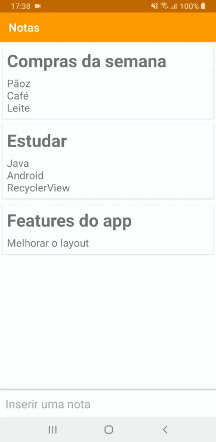

# app-Tarefas
CRUD de lista de tarefas com titulo e descrição.

O app permite criar, alterar e remover notas. 

Para remover as notas é utilizada a função de deslizar as notas, assim como também pode ser realizada a reordenação da lista ao clicar e arrastar.

(app com a ideia basica de criar listas utilizando recyclerview e suas funcionalidades)

